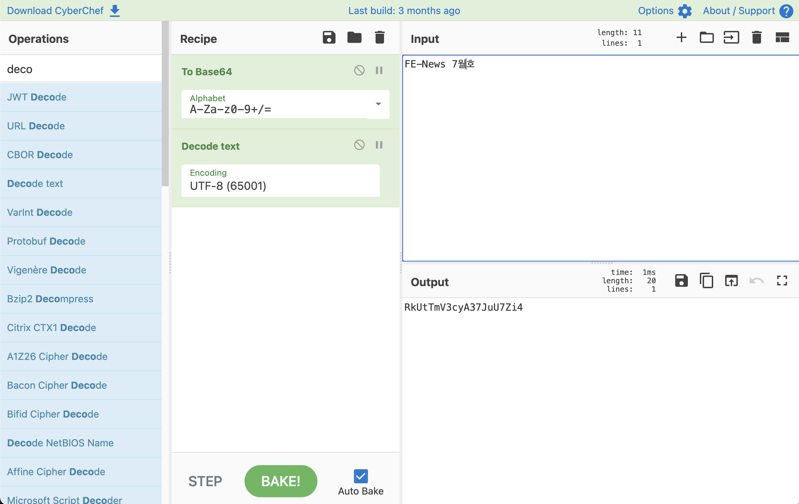

# 링크 & 읽을거리
## [React 18 변경점](https://velog.io/@jay/React-18-%EB%B3%80%EA%B2%BD%EC%A0%90)

2021.6.8 React 공식 페이지에서 [React 18에 대한 계획](https://reactjs.org/blog/2021/06/08/the-plan-for-react-18.html)을 공유하였다. 이 글은 React 18에서 변경될 Suspense ssr architecture, State batch update, Transition 에 대해 설명한 글이다. 

기존에는 개발자가 직접 제어해야하거나 제약이 있던 SSR 랜더링 부분이 pipeToNodeWritable, Suspense와 Lazy를 통해 React 단위에서 효과적으로 적용할 수 있게 된다.


기존에 부분 적용되었던 State batch update도 api 요청, timeout과 같은 비동기 작업 내에서도 자동 적용된다. 뿐만아니라 상태 업데이트의 우선순위를 정할 수 있는 startTransition 인터페이스도 제공한다.

React 18은 기존 Major 버전 업그레이드와 동일하게 어플리케이션 코드 변경 없이 손쉽게 적용할 수 있기에 정식 릴리즈가 되면 부담없이 적용해 보면 좋을 것 같다.

> [참고] 문서 전체를 살펴보기 부담스럽다면, 다음의 12개 트윗으로 정리된 요약본을 확인하라.
> https://twitter.com/ProvablyFlarnie/status/1406729279317045248
> 
> [참고] Project React 18 릴리즈 일정은 다음을 참고하기 바란다.
> https://reactjs.org/blog/2021/06/08/the-plan-for-react-18.html#projected-react-18-release-timeline

## [React — 5 Things That Might Surprise You](https://medium.com/geekculture/react-5-things-that-might-surprise-you-ddefd9fbac0f)
React에 대해 잘못 사용하고 있을 만한 5가지 내용을 다루고 있다. 이 글에 나온 예시를 통해 조금 더 React를 잘 이해하길 바란다.

## [5 Advanced React Patterns](https://javascript.plainenglish.io/5-advanced-react-patterns-a6b7624267a6)

단순한 Couter 예제를 바탕으로 5가지 React 패턴을 제어의 역전, 구현 복잡도 기준으로 설명한다.


## [Why React Hooks cannot be conditioned](https://blog.atomrc.dev/p/why-you-cannot-condition-react-hooks/)

React hooks와 함께 [/eslint-plugin-react-hooks](https://github.com/facebook/react/tree/master/packages/eslint-plugin-react-hooks)을 사용해봤다면, `React Hook "useState" is called conditionally.`와 같은 예기치 않은 경고 메세지와 맞닥뜨린 경험이 있을 것이다.

```js
function Component({ doEffect }) {
  // {value: 0, next: {value: 0, next: null}}
  const [first, setFirst] = useState(0);
  if (doEffect) {
    // {value: 0, next: null}
    useEffect(/*...*/); // ⚠️ Wrong hook here
  }
  // null
  const [second, setSecond] = useState(0); // ⚠️ No hook left!!
}
```

이 글은 Hooks가 왜 조건식을 통해 사용될 수 없는지를 설명한다.

## [Next.js 11 정식 릴리즈](https://nextjs.org/blog/next-11)
Next.js 11이 2021.6.16 정식 릴리즈 되었다. 11 버전에서는 React Fast Refresh 를 개선하여 시작 시간을 최대 24% 개선하였고, 변경 처리시간을 40% 단축 시켰다. 뿐만아니라 기본 번들러 도구로 Webpack5를 제공함으로써 Webpack5의 장점을 Next.js 11에서도 체감할 수 있다.
또한 `next/script`, `next/image`와 같은 모듈도 제공하여 손쉽게 스크립트 제어와 이미지 플레이스 홀더 제어를 할 수 있게 되었다.
그 외에 Create React App Migration, Next.js Live 기능을 실험적으로 이용할 수 있게 되었다.

## [ES2021](https://h3manth.com/ES2021/)
2021.6.22 ES2021 스펙이 정식 승인 되었다. JavaScript가 꾸준히 발전하고 있네요.
- Logical Assignment Operators (&&= ||= ??=)
- Numeric Separators (1_000)
- Promise.any & AggregateError
- String.prototype.replaceAll
- WeakRefs & FinalizationRegistry


## [How To Fix Cumulative Layout Shift (CLS) Issues](https://www.smashingmagazine.com/2021/06/how-to-fix-cumulative-layout-shift-issues/)
이미지 크기 부터 폰트, JavaScript 적용등 다양한 영역에서 발생 할 수 있는 CLS 이슈 해결 방법을 조목 조목 설명하고 있다. 개발하고 있는 서비스에 차근차근 적용해보기 좋은 글이다.

## [Towards a better responsiveness metric](https://web.dev/better-responsiveness-metric/)
사용자 반응성에 영향을 미칠수 있는 metric로 FID(First Input Delay)를 살펴보고 사용자 반응성을 높일수 있는 몇가지 아이디어를 기술하고 있다.


## [Introducing Aurora](https://web.dev/introducing-aurora/)

크롬 엔지니어(내부 코드명 WebSDK)팀 은 지난 2년간 주요 오픈소스 프레임워크/도구들과의 협업을 통해 더 나은 사용자 경험을 제공하기 위한 노력을 해왔으며, 지난 6월 15일 이를 "Aurora"라 명명했다.

목표는 단순하다. 앱이 어떤 브라우저에서 렌더링 되는 것인지 상관없이, 가장 뛰어난 사용자 경험을 제공하는 것이며, 앞으로 몇 개월간 보다 자세한 내용들을 공개할 예정임을 밝혔다.


Aurora의 첫 번째 작업은 "Comformance"라 불리며, JavaScript 프레임워크 생태계에 집중해 예측 가능한 로딩 성능과 [Core Web Vitals](https://web.dev/vitals/#core-web-vitals) 점수를 높일 수 있도록 코딩 모범사례를 구현할 수 있도록 도움을 주는 것에 목표를 두고 있다.

- [Conformance for Frameworks](https://web.dev/conformance/)

## [Forming the WebExtensions Community Group](https://www.w3.org/community/webextensions/2021/06/04/forming-the-wecg/)

지난 수년간 브라우저 확장 익스텐션(플러그인)들의 사용의 증가와 함께 다수 브라우저들에서의 상호 호환 모델 채택 등의 움직임에 따라 확장 익스텐션의 표준화된 접근의 필요성이 대두되었고, 이를 위해 W3C 산하 WebExtenstions Community Group(WECG)가 지난 6월 4일 주요 브라우저 벤더들인 Apple, Google, MS 그리고 Mozilla가 참여를 통해 만들어졌다.


## [History of the Web: Part 1](https://www.matthewgerstman.com/tech/history-of-the-web/)

저자의 지난 20년간 웹 영역에서의 기술적 경험을 바탕을 통해 웹의 역사를 간략하게 정리한 내용의 글이다.

웹을 구성하는 요소들이 어디에서부터 시작되었는지를 알게 되면, 어디로 가야 하는지 알 수 있기 때문에 지난 역사에 대한 문맥을 아는 것이 중요하다고 생각해 글을 작성하게 되었다고 그 이유를 밝히고 있다.


## [MDN Plus](https://developer.mozilla.org/en-US/plus)

MDN에서는 업계의 전문가들이 참여하는 월간 심층 기술적 문서를 제공하는 새로운 유료(월 $10 또는 연 $100 정도의) 프리미엄 서비스인 "MDN Plust"를 계획하고 있다. 기존의 MDN Web Docs는 어떠한 변화도 없이 기존과 같이 무료로 제공될 것임을 밝히고 있다.


# 튜토리얼

## [Anyone Can Learn CSS Grid](https://www.euismod.dev/)

<video src="https://www.euismod.dev/dist/media/lightmode-display.mov" width=500 playsinline loop></video>

CSS Grid의 핵심 요소들을 배울 수 있다. 직접 Grid 속성들에 대한 값을 입력해 렌더링 결과를 즉시 확인할 수 있어, 매우 직관적인 학습을 진행할 수 있다.


## [Generating (and Solving!) Sudokus in CSS](https://css-tricks.com/generating-and-solving-sudokus-in-css/)
JavaScript 한 줄 없이 스도쿠를 구현한 튜토리얼이다. CSS를 이용한 프로그래밍을 경험해 보기에는 충분한 튜토리얼이다.


# 코드와 도구

## [Utopia](https://github.com/concrete-utopia/utopia)


디자인과 개발 환경(VSCode)이 통합된 온라인 React 개발 환경 도구로 제공되는 디자인 도구와 작성된 코드를 통해 실시간 편집과 완성된 결과를 미리 보기를 통해 확인할 수 있다.

아직 개발 초기 단계지만, 직접 사용해 볼수 있다. 보다 자세한 내용은 [Introducing Utopia](https://utopia.app/blog)를 통해 확인할 수 있다.

## [The DOM Event Visualizer](https://domevents.dev/)


프레임워크의 사용이 보편화되면서, DOM 이벤트가 어떻게 흐르는지 세부적인 내용을 이해하지 못한 채 이벤트를 다루고 있는 것이 현실이다. 직접적으로 다루지는 않더라도, 이벤트 처리의 본질적인 것은 달라지지 않기 때문에 보다 깊은 이해를 위해선 DOM에서 이벤트가 어떻게 동작하는지를 아는 것은 중요하며, 링크를 통해 제공되는 도구를 통해 시각적인 이벤트 흐름을 쉽게 확인해 볼 수 있다.

> DOM 이벤트에 대해 보다 깊게 이해하고 싶다면, 다음의 무료 온라인 강의 동영상을 참고하라.
> [Your Ultimate Guide to Understanding DOM Events](https://egghead.io/courses/the-ultimate-guide-for-understanding-dom-events-6c0c0d23)

## [yare.io](https://yare.io/)

JavaScript 코드 작성을 통해 유닛을 제어하는 실시간 전략 게임이다.


## [CyberChef](https://gchq.github.io/CyberChef/)

사이버상의 "스위스 아미 나이프"를 표방해, 입력값에 대한 다양한 변환작업(암호화, 인코딩, 등)을 손쉽게 수행할 수 있는 웹 도구다.



## [n8n](https://github.com/n8n-io/n8n)


Node 기반의 워크플로우 자동화 도구다.

> 아래의 데모 동영상에선, GitHub Star에 대한 Slack 알림을 받는 자동화 구성방법을 확인할 수 있다.
> [n8n.io - Slack Notification on Github Star](https://www.youtube.com/watch?v=3w7xIMKLVAg)


## [Lighthouse Metrics](https://lighthouse-metrics.com/)
간단하게 사이트의 Lighthouse Metrics를 지역별로 확인해 볼 수 있다. 내가 개발 중인 서비스의 성능 지표를 손쉽게 확인해보자.

## [Google Map React](https://github.com/google-map-react/google-map-react)

Google Map React를 사용하면, 구글 지도 위에 어떠한 React 컴포넌트라도 렌더링 할 수 있도록 구성할 수 있다.

## [Wu Tang Lorem Ipsum Text Generator](https://s-kngstn.github.io/wu-loremipsum/)

Vanilla JavaScript로 작성된 텍스트 생성기로 테스트 용도로 간편하게 사용할 수 있다.

## [Better Comments](https://marketplace.visualstudio.com/items?itemName=aaron-bond.better-comments)
VS Code Extension으로 Alerts, Querie, TODO, Highlight와 같은 다양한 종류의 커멘트를 편집기에서 표현할 수 있다.


## [Highlight Matching Tag](https://marketplace.visualstudio.com/items?itemName=vincaslt.highlight-matching-tag)
HTML 태그 짝을 시각적으로 표시해주는 VS Code Extension 이다.


## [depcheck](https://github.com/depcheck/depcheck)
depcheck를 통해 실제 사용하지 않거나 누락된 npm 모듈을 확인 할 수 있다. CI에 도입하면 좋은 라이브러리이다.
```sh
$> depcheck /path/to/my/project
Unused dependencies
* underscore
Unused devDependencies
* jasmine
Missing dependencies
* lodash
```