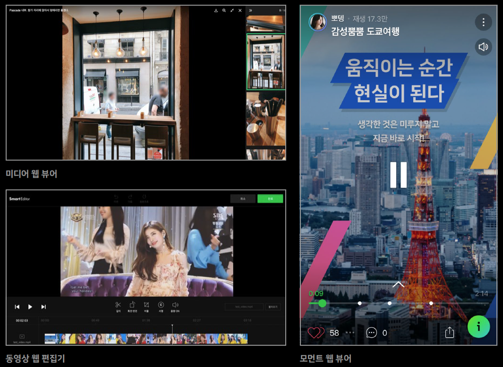

# Apollo FE Dev

대한민국 모든 사용자들이 사용하는 네이버 UGC 서비스 FE 개발을 담당합니다.
- 블로그, 지식iN eXpert, 인플루언서 서비스의 FE개발과 운영을 담당하고 있습니다.  
- Front-end 기술을 활용하여 대용량 트래픽을 효과적으로 처리하기 위해 고민하고 있습니다.  
- 더불어 서비스 안정성과 품질을 높이기 위해 지속적인 개선활동을 진행해 나가고 있습니다.  

|  |  |  |
| -- | -- | -- |
| 블로그 | 지식iN eXpert | 인플루언서 |

UGC 서비스 개발과 운영 경험을 바탕으로 만들어진 고도화된 UGC 툴을 개발하고 있습니다.
- 미디어를 더 가치 있게 사용자에게 보여주는 전사 미디어 웹뷰어 개발
- 숏폼 동영상을 손쉽게 보여주는 모먼트 웹뷰어 개발
- 동영상을 웹에서 손쉽게 편집 할 수 있는 동영상 웹 편집기 개발
- UGC 서비스의 개발 노하우가 담긴 UGC 공통 모듈 개발

글로벌 UGC 서비스를 위한 새로운 도전을 준비중입니다.
- 국내 UGC 서비스의 개발과 운영 경험을 바탕으로 글로벌로의 진출을 계획하고 있습니다.

## 역할

- 국내 UGC 서비스 FE 개발
- 해외 UGC 서비스 FE 개발
- UGC 툴 FE 개발

## 기술 스택

- Typescript
- React
- Redux / Apollo Client
- Node.js(SSR) / Graph QL
- nginx, Helm, Docker, Kubernetes
- Sentry, Grafana, Npot

## 기술 공유
> Applo FE Dev에서는 FE 개발자들의 성장을 위해 다음과 같은 기술 공유 활동을 하고 있습니다.

- [네피셜 - 사용자가 많은 서비스의 프론트엔드 개발자는 어디까지 ‘진화’해야 할까](https://m.blog.naver.com/naver_diary/222159387077)
- [Deview2020 - 어서와, SSR은 처음이지? (네이버 블로그 Node.js 기반의 Server-Side Rendering 적용기)](https://deview.kr/2020/sessions/403)
- [D2 - 어서 와, SSR은 처음이지? - 도입 편](https://d2.naver.com/helloworld/7804182)
- [D2 - 어서 와, SSR은 처음이지? - 개발 편](https://d2.naver.com/helloworld/2177909)
- [TECH CONCERT: FRONT END 2020 - Code Review is Horse(코드리뷰는 말이야)(feat.Latte)](https://tv.naver.com/v/15355381)
- [TECH CONCERT: FRONT END 2019 - 오늘부터 나도 FE 성능분석가](https://tv.naver.com/v/8129232)

## 채용 정보
### 자격요건 및 필요역량

- 관련 분야에서 2년 이상 실무 경험을 보유하신 분
- 다양한 프레임워크 개발 경험을 보유하신 분
- JavaScript 생태계의 언어와 툴의 깊은 이해를 가지신 분
- 코드 리뷰 활동이 적극적이신 분
- JavaScript에 대한 이해가 있으신 분
- React 기반 SPA 개발 및 운영 역량을 보유하신 분(React/Redux/GraphQL)
- SDK 개발에 대한 충분한 이해와 공통 API 설계 능력을 보유하신 분

### 우대 사항

- 테스트 코드를 실무에서 적극 활용하신 경험
- 크로스브라우저 환경 서비스 개발 경험
- 성능 개선 경험
- 대용량 트래픽 환경에서 장애 방지, 서버 가용성(availability)과 확장성(scalability) 확보를 위한 인프라 엔지니어링을 경험하신 분
