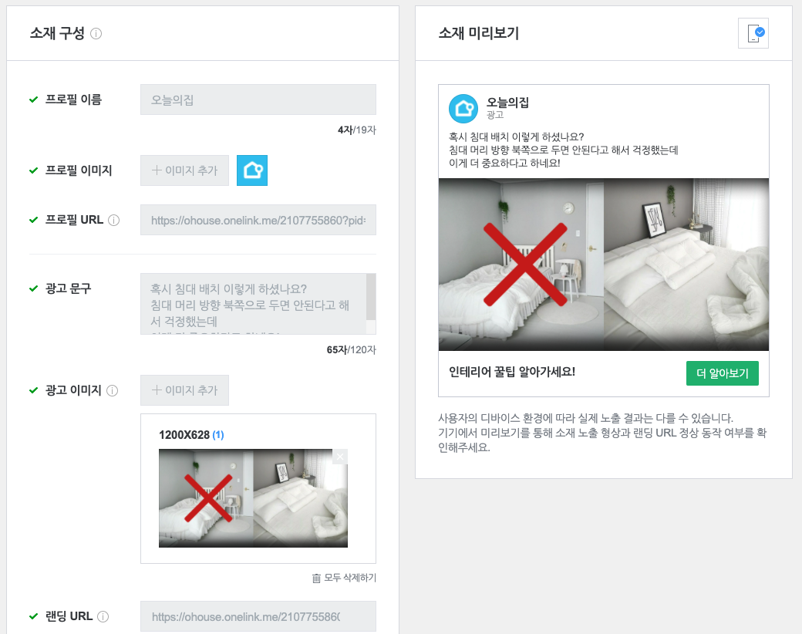
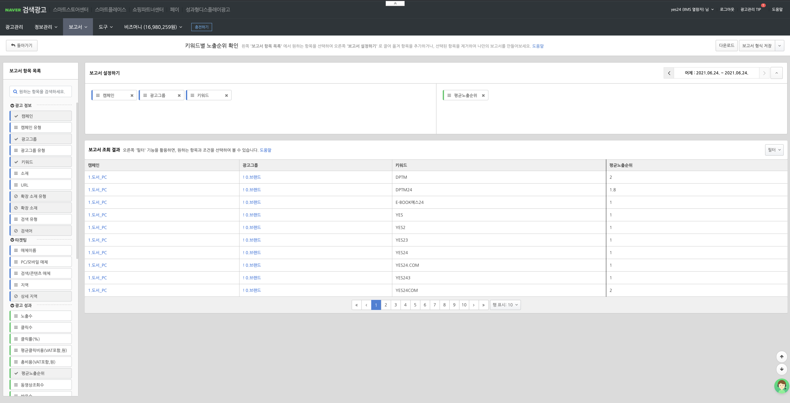
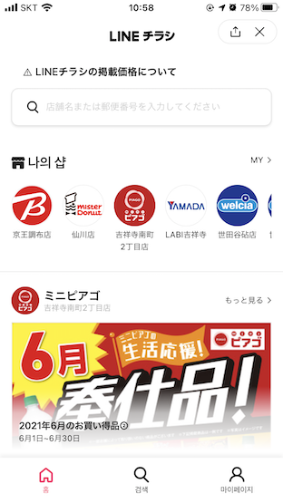
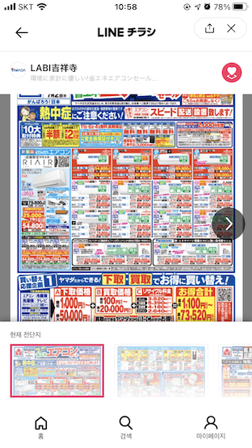
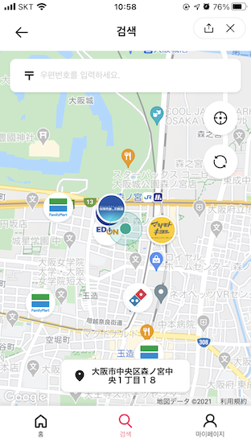
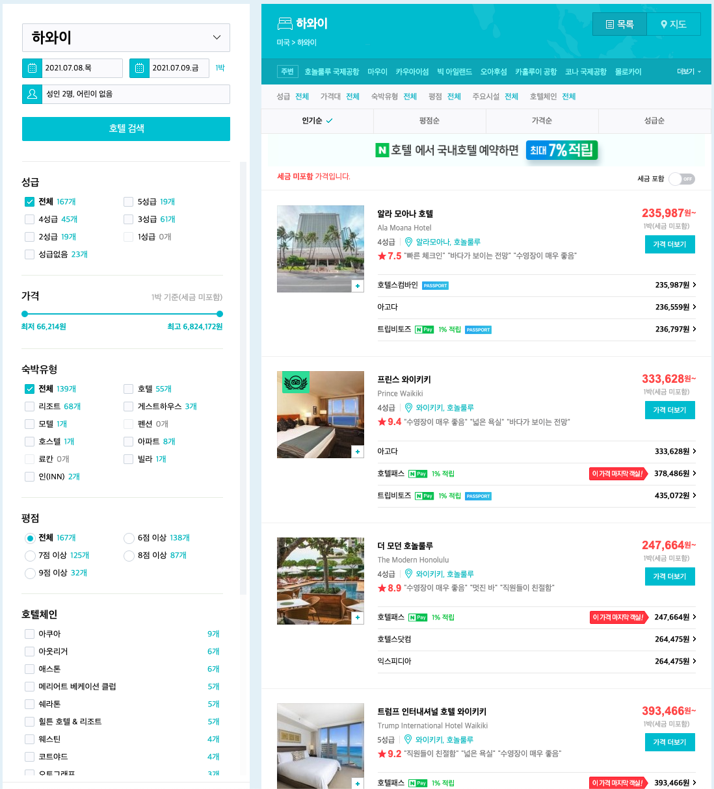

# Biz CIC

저희 조직은 네이버 매출의 근간이 되는 검색 광고와 디스플레이 광고 그리고 여행(호텔, 항공권 등) 서비스를 담당하고 있습니다.

## 서비스
- 네이버와 라인의 디스플레이 광고 플랫폼(DSP) 및 웹 SDK(SSP)
  - 국내 네이버앱뿐 아니라 LINE, 웹툰, Vlive, 네이버 뉴스 등 다양한 영역으로 광고를 송출하고 있습니다.
  - 광고주들이 자신의 광고를 등록하고 원하는 고객에게 타겟팅 할 수 있는 시스템을 개발합니다.

- 네이버와 라인의 검색광고 플랫폼
  - 네이버 매출에서 가장 큰 비중을 차지하고 있습니다. 20억건이 넘는 광고를 등록하고 송출하는 서비스를 개발합니다.
  - 광고주들이 자신의 광고를 등록하고 다차원 리포트로 성과를 추적, 개선할 수 있는 시스템을 개발합니다.
  

- LINE チラシ(전단지)
  - 2019년 10월에 오픈하여 현재 1200만명+ 사용자가 사용하고 있습니다. 
  - LINE 전단지 서비스를 통해 지역기반으로 주변 상점의 전단지 정보와 상품정보를 검색할 수 있습니다

  

- [네이버 항공권 & 호텔 서비스 개발](https://flight.naver.com/flights/)
  - 네이버에서 여행관련 상품들을 검색하고 가격을 비교하여 가장 최적의 상품을 예약할 수 있는 서비스를 개발하고 있습니다.
  - 국내를 포함하여 전세계 어디든 여행하기 위한 가장 필수 적인 서비스들을 개발&운영 하고 있으며 최신의 정확한 여행 정보를 제공하기 위한 플랫폼을 개발하고 있습니다.
  

## 기술 스택
- Javascript, Typescrpt, ES6
- React(Vue), Redux(Vuex), Next.js(Nuxt.js)
- Node.js, Koa.js, GraphQL
- MongoDB, Git

## 채용하고 싶은 사람
- 네이버 매출을 책임지는 광고 비지니스에 기여한다는 자부심을 가지고 더 좋은 서비스를 고민할 수 있는 분
- 꾸준히 최신 기술을 학습하며 장단점을 파악하고 조직원과 공유할 수 있는 분
- 주어진 업무를 수동적으로 처리하는 것이 아닌 적극적으로 개선방안을 고민하고 논의하여 함께 최고의 사용자 경험을 만들어가고자 하는 분
