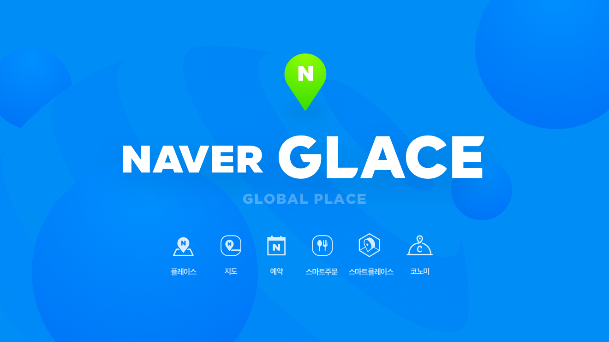
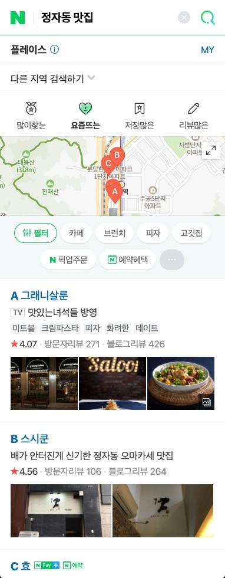
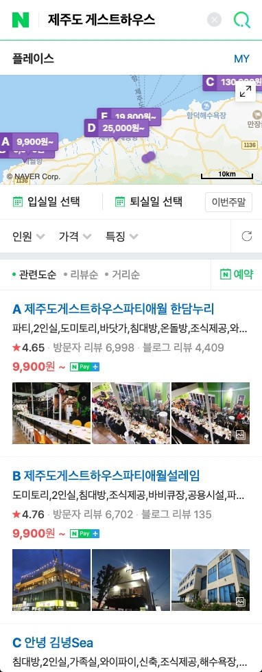
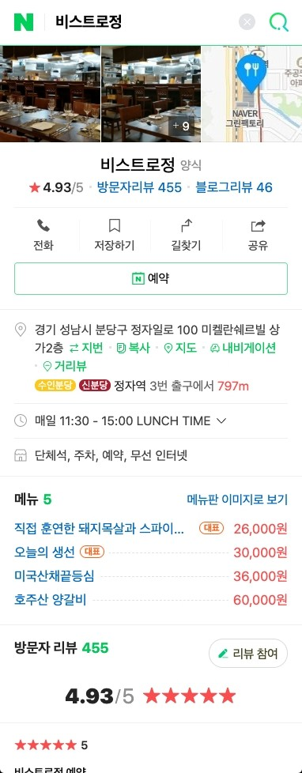
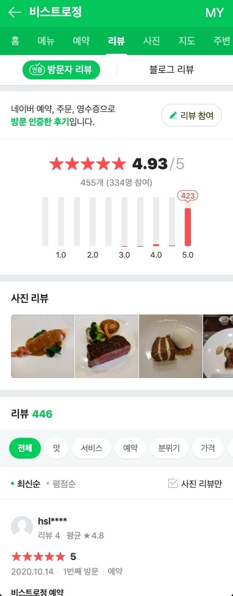
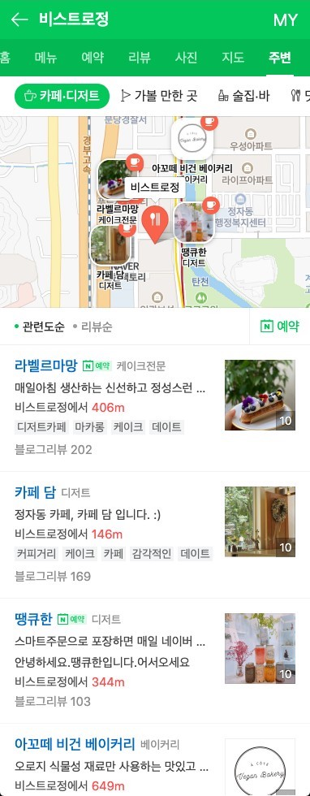

# Glace 플레이스 서비스 개발

NAVER 플레이스서비스개발 팀은 한국과 글로벌 플레이스 검색 개발 서비스를 만들고 있습니다.

Glace CIC는 기술로 수백만의 오프라인 상공인과 수천만의 NAVER 사용자를 연결하는 일을 담당하고 있는 Company-In-Company 입니다.

NAVER 전체 검색의 15% 응답을 차지할 만큼 많은 사용자에게 알맞는 장소를 찾아주고 정보를 전달하는 역할을 하고 있습니다.

|  |  |  |
| -- | -- | -- |
| 
식당 검색
 | 
숙소 검색
 | 
뷰티 검색
 |

## NAVER 플레이스서비스개발 팀은 한국과 글로벌 플레이스 검색 개발 서비스를 만들고 있습니다.

식당, 숙박, 뷰티, 명소 등 주요 업종 특화 검색을 제공하여 성장한 플레이스는 병의원, 은행, 주유소, 편의점 등  특화 업종을 늘려나가면서 사용자에게 보다 도움이 되는 정보를 전달하려고 노력합니다.

JavaScript Web Fullstack으로 적은 인원으로 생산성 높은 개발을 지향합니다. FE/BE로 업무를 나누지 않고 업종으로 업무를 나눠 한 사람이 FE/BE 모두 소화하고 설계할 수 있는 자유도를 갖습니다. 안정적으로 NAVER 통합 검색 트래픽을 받아내고 있어 대규모 트래픽 서비스 경험을 해볼 수 있는 장점이 있습니다.

올해에는 전국민이 사용하는 공적 마스크 재고 현황을 노출하는 서비스를 3일만에 개발하여 서비스 하는 기민함도 보였습니다.

플레이스 서비스는 모바일 검색창에서 뻗어나와 NAVER 지도앱과 PC지도 웹 서비스의 장소검색 결과로 확장했습니다.  한 벌의 코드로 여러 환경을 지원하며 효율적인 서비스 운영을 고민합니다. 즐겁게 함께 성장하며 개발할 동료를 찾고 있습니다.

|  |  |  |
| -- | -- | -- |
| 
업체 상세
 | 
업체 리뷰
 | 
업체 주변
 |

## 개발 조직 문화

최신 기술을 적극 활용하며 코드 리뷰로 함께 성장하는 문화를 가지고 있습니다. 주니어와 시니어 구분이 없으며 본인 주도적으로 일하고,
자율적인 출퇴근 시간 등 자율 책임 문화를 지향합니다.
개발에 집중하며 github 등 온라인 협업도구를 적극적으로 활용합니다.

## NAVER 플레이스는 어떻게 개발하는지 궁금하다면?

개발 블로그 https://medium.com/naver-place-dev

## 기술 스택 – JavaScript Web Fullstack

- Typescript
- Node.js with Koa
- React with hooks
- GraphQL with Apollo for API
- MongoDB / ElasticSearch / redis - Kubernetes for deployment

## 채용 인재상

\# 적극성

\# 호기심

\# 성장

\# 공유
