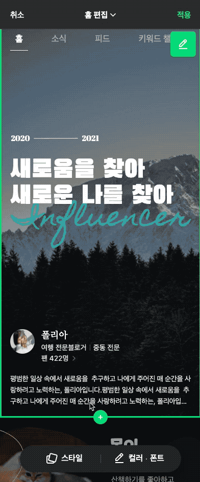
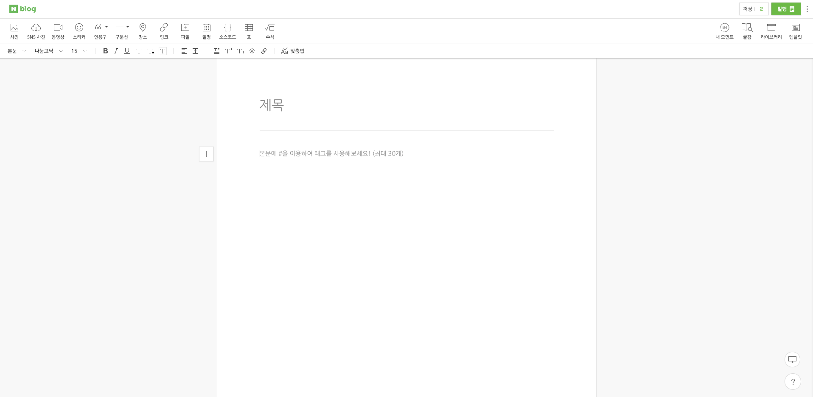

# HomeBuilder

## ⌘ 동료를 찾습니다!

NAVER ETECH SmartStudio > HomeBuilder 팀에서 함께 일할 개발자(백엔드, 프론트엔드 무관)를 찾습니다.

HomeBuilder 팀은 사용자가 이미지, 동영상, 텍스트 등을 드래그 앤 드롭으로 조합해서 자신만의 UI를 손쉽게 만들 수 있는 WYSIWYG 플랫폼 HomeBuilder를 개발합니다.

관심이 있는 분은 아래에 있는 이메일 주소로 이력서(형식 무관)를 보내주세요. 궁금한 점이 있으신 분도 메일로 문의주시면 최대한 빠르게 답변 드리겠습니다!

💌  dl_smartstudio_recruit@navercorp.com

### 이런 일을 합니다

- HomeBuilder 플랫폼 설계 및 개발(FE/BE)
- HomeBuilder 플랫폼 운영도구 개발
- HomeBuilder 플랫폼 인프라 구축 및 운영
- 로깅 및 통계 개발

### 이런 기술을 사용해요

#### 공통

- TypeScript
- ESLint, Prettier
- Jest
- Lerna(for monorepo) → Yarn Berry 전환 예정
- Webpack
- GitHub Enterprise

#### 프런트엔드

- React
- Redux

#### 백엔드

- NodeJS, Express
- N2C(docker, kubernetes)
- MongoDB
- Nginx
- Redis

#### DevOps

- Jenkins
- NDeploy(네이버 사내 빌드/배포 플랫폼)
- Kubernetes, Docker 등

#### 기타

- Slack
- Jira
- Confluence

### 이런 분이면 좋겠어요

🙋‍♂️ 네이버 전사 규정을 따라 경력 2년 이상인 경우 경력 채용으로 인정이 되며, 경력 2년 미만은 신입 채용 프로세스로 진행합니다.

- 웹 프런트엔드 또는 백엔드 개발 경험
- HTML, CSS 등 W3C 웹 표준 규격 이해
- 객체지향, 함수형 등의 프로그래밍 지식 보유
- 🙏 아는 것을 나누며 팀과 함께 성장할 수 있는 분
- 🙏 늘 배우고 더 나아지려고 노력하는 성향을 가진 분
- 🙏 공동의 목표 달성을 위해 기꺼이 팀 플레이를 할 수 있는 분
- 🙏 콘텐츠 저작도구에 관심이 있는 분

### 이런 경험이 있으면 더 좋아요

🙋‍♂️ 아래 경험은 필수 자격요건이 아닙니다. "있으면 좋다"로 이해해 주세요.

- 대규모 시스템 설계, 개발, 운영 경험
- 네트워크 인프라 관련 운용 경험
- Kubernetes, Docker 사용 및 운용 경험
- 대용량 트래픽의 NodeJS 서버 운용 경험
- 웹 접근성 적용 경험
- 성능 최적화 경험
- 테스트 코드 작성 및 자동화 경험

## ⌘ HomeBuilder는 말이죠!

HomeBuilder는 NAVER의 WYSIWYG 웹UI 제작 도구입니다. HomeBuilder를 이용하면 나의 텍스트, 이미지, SNS 정보 등을 조합해서 드래그 앤 드롭만으로 자신이 원하는 UI를 만들 수 있습니다.

현재 HomeBuilder는 NAVER 인플루언서 검색을 이용하는 인플루언서가 자신의 홈을 자유롭게 꾸밀 수 있는 UI 빌더를 제공하고 있습니다.

이런 좋은 기술을 하나의 서비스 안에만 둘 수는 없겠죠? 인플루언서 검색의 HomeBuilder를 개발할 때 UI 빌딩 기술을 SDK로 모듈화 해두었고, 내년에는 더 많은 서비스에서 HomeBuilder를 만나볼 수 있습니다.

여기에서 더 나아가 요즘 우리 팀은 HomeBuilder의 미래를 그리며 몇 가지 즐거운 상상을 하고 있습니다.

**HomeBuilder로 SmartEditor를 만들 수 있다면?**

단순히 UI 레이아웃을 꾸미는 것을 넘어서 드래그 앤 드롭으로 애플리케이션을 만들 수도 있다면 어떨까요? 우리가 가진 기술로 더 재미있는 일을 해 볼 수 있지 않을까요?

이런 에디터를 드래그 앤 드롭으로 만들 수는 없을까요? 🤔

**우리의 UI 빌딩 기술을 누구나 쉽게 가져다 쓸 수 있다면?**

SmartStudio는 오랫동안 콘텐츠 저작 도구인 SmartEditor를 개발하며 기술을 축적했습니다. HomeBuilder는 SmartEditor의 기술을 근간으로 만들어졌습니다. 웹에서 콘텐츠는 결국 UI입니다. 콘텐츠 저작 도구는 사실 UI 저작 도구인 셈이죠. 더 많은 사람이 우리가 가진 UI 빌딩 기술을 이용할 수 있다면 어떨까요? 그렇게 만들어진 생태계 안에서 정말 멋진 일이 일어날 것 같지 않으세요?

지금 팀에 합류하면 이런 상상을 우리와 함께 할 수 있습니다.

## ⌘ 이런 경험을 할 수 있어요!

### 🧑‍💻 No-code 제작 도구를 직접 개발!

요즘 언론에 자주 오르내리는 버즈 워드가 노코드(No-code or Low-code) 플랫폼입니다. [Retool](https://retool.com/), [Suqarespace](https://www.squarespace.com/), [Notion](https://www.notion.so/product) 같은 서비스가 노코드 플랫폼입니다. 사용자는 플랫폼이 제공하는 기능 블럭을 조립하여 손쉽게 원하는 애플리케이션을 만들 수 있습니다.

노코드 도구를 만드는 일은 다른 개발자가 해야 할 고민을 대신하는 일이기도 합니다. UI 개발을 하면서 만날 수 있는 모든 상황이 우리가 풀어야 할 문제입니다. 디자인, UI 표현, 데이터 연동, 인터렉션 등 UI 개발의 모든 측면을 이해하고, 이해를 추상화하여 도구에 담아야 합니다. 좋은 플랫폼은 고객의 요구를 있는 그대로 모두 수용하지 않습니다. 문제의 본질을 이해하고 치열하게 고민하여 더 나은 대안을 제품에 녹여야 합니다.

그만큼 어렵고 어려워서 재미있습니다. 성장 세포를 자극하는 이야기가 가득하니까요.

### 💪 성장하는 팀과 함께 성장!

HomeBuilder 팀은 이제 막 태어난 어린 아이입니다. 앞으로 많이 배우고 성장해야 합니다. HomeBuilder 팀도 여느 팀처럼 좋은 개발 문화를 추구합니다. 이런 걸 하고 있습니다.

- 2주 단위 스프린트를 기본 프로세스로 일을 합니다.
- 이슈 티켓은 Jira로, 문서는 Confluence로 관리합니다.
- ESLint + Prettier 같은 도구를 적극 활용해 일관성 있는 코드를 지향합니다.
- 코드 리뷰와 테스트 자동화 등의 지속 가능한 개발 문화를 지향합니다.
- 업무 환경을 점진적으로 개선하며 팀이 함께 성장하는 환경을 만들어 갑니다.

하지만 잘하고 있다고 말하기는 어렵습니다. 우리는 이제 막 태어났으니까요. 단순히 '하는 것'과 '잘하는 것'은 차원이 다른 이야기입니다. 매일 조금씩 성장🛫해서 내년에는 오늘보다 훨씬 나은 소년👦이 되고 싶습니다.

그래서 요즘 팀이 가장 신경 쓰는 부분은 "팀과 개인이 함께 성장하는 토대 만들기"입니다. 매주 모두가 참석하는 "팀 빌드업 미팅"에서 팀을 성장 시킬 여러가지 아이디어를 논의합니다. 지금 합류하시면 개발 문화를 함께 만들며 성장할 수 있습니다.

### 🤼‍♂️ 프런트엔드, 백엔드? 원한다면 둘 다!

HomeBuilder의 백엔드는 TypeScript와 Node.js로 구현되어 있습니다. 지금은 백엔드와 프런트엔드가 다른 저장소로 분리되어 있지만 곧 Monorepo로 통합합니다. 통합 후에는 프런트엔드와 백엔드를 자연스럽게 넘나들며 개발을 할 수 있습니다.
풀스택 개발자로 커리어를 쌓고 싶다면 팀이 적극 지원해 드립니다. 네이버의 사내 교육 시스템은 꽤 훌륭합니다.
반드시 풀스택 개발을 해야 하는 건 아닙니다. 다만, 기회가 열려 있다는 뜻으로 이해해 주세요. 지원자의 의사를 존중합니다.

### 🛫 글로벌로 간다!

HomeBuilder는 글로벌 플랫폼을 지향합니다. 다국어 지원, 대용량 트래픽 처리, 현지 사정을 고려한 UX 설계, 다양한 서비스 요구사항 통합 등 듣기만 해도 설레는 도전이 기다립니다. 복잡하고 큰 문제를 다루는 시스템을 만들면서 쌓인 경험치가 우리를 더 강하게 만듭니다.
