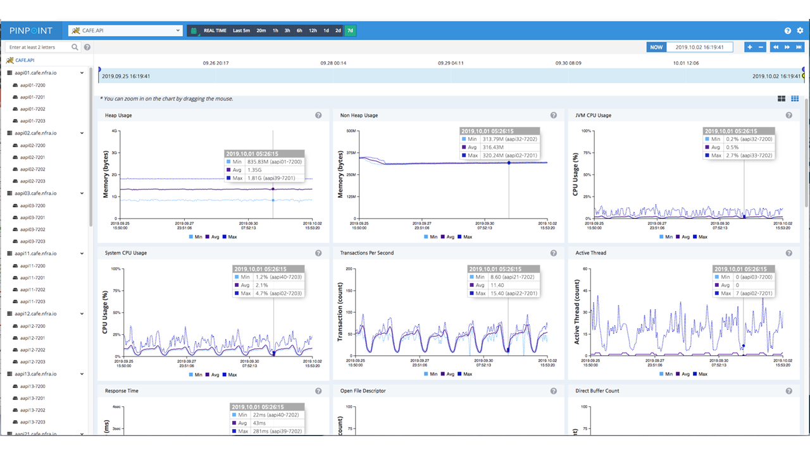

# Platform Labs

Platform Labs는 네이버를 위한 Platform 들을 개발하고
서비스에 제공하여 서비스의 경쟁력을 향상하는 것을 목적을 갖고 있으며,
다음의 산하 조직으로 이루어져 있습니다.

## Observability Platform
네이버의 다양한 서비스들이 운용하는 서버 상태에 대한 실시간 모니터링과 로그, 차트 도구를 오픈소스로 개발하고 있으며,
이를 통해 사전적 장애 예방, 성능저하 방지/개선 등을 통해 안정적인 서비스 운영이 가능하도록 도움을 주고 있습니다.

### Pinpoint

- https://github.com/naver/pinpoint

> [참고] [대규모 분산 시스템 추적 플랫폼, Pinpoint](https://d2.naver.com/helloworld/1194202)

### billboard.js

재사용 가능하며, 간결하고 쉬운 인터페이스 웹 차트 라이브러리
- https://github.com/naver/billboard.js

## Plasma FE
네이버 페이의 새로운 아키텍처를 구현하는 'Plasma 프로젝트'를 진행하고 있습니다.

- https://pay.naver.com/

네이버페이의 폭발적인 사업 성장을 뒷받침하는 안정되고 확장 가능한 플랫폼을 구축하는 목표를 갖고 있습니다.
기존의 monolithic하게 구현되어 있는 시스템을 작은 단위의 프로젝트로 재구성하고,
이를 재사용 가능한 최신 FE 기술 스택으로 안정적으로 교체하는 작업을 진행하고 있습니다.

## 기술 스택
### Observability Platform
- 프레임워크: Angular, React
- JS Flavor: ES6+, TypeScript
- Backend: Node.js + Express + Apollo GraphQL
- Bundler: Webpack, Rollup.js
- State management: Redux, Recoil

### Plasma FE
- Framework: React
- JS Flavor: ES6+, Typescript
- Backend: Node.js + Express + Apollo GraphQL
- Bundler: Webpack
- Test: Jest, Puppeteer, Storybook

## Front-end 기술 공유 활동

Platform Labs에서는 다음과 같은 다양한 Front-end 기술 공유 활동을 진행하고 있습니다.

- JavaScript 동향 시리즈 발간
  - [2020년과 이후 JavaScript의 동향 - JavaScript(ECMAScript)](https://d2.naver.com/helloworld/4268738)
  - [2020년과 이후 JavaScript의 동향 - WebAssembly](https://d2.naver.com/helloworld/8257914)
- FE News: 월간 FE 기술뉴스 레터
  - https://github.com/naver/fe-news