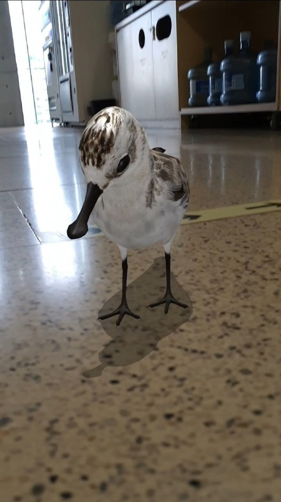

# Search FE

> 팀 직무 안내 https://naver-career.gitbook.io/kr/service/search/reliability-platform/search-fe

### 글로벌 검색 서비스 FE의 품질관리를 하고 공통 모듈을 개발합니다.

- 글로벌(네이버/라인) 검색 서비스 FE 공통 영역을 관리합니다.
- 통합검색, 동영상 검색, VIEW 검색 등 컬렉션 영역과 공통 모듈을 개발하고 성능 개선 및 품질 관리를 담당하고 있습니다.

|  |  |
| -- | -- |
| 네이버 동영상 검색 | 라인 검색 |

### 사용자의 편의성을 높이는 스마트 서비스를 개발합니다.

- 그린닷/통합검색으로부터 진입되는 인식&주제검색 서비스를 담당합니다.
- 모바일 검색 사용자의 좀 더 나은 편의와 다양한 경험을 주고자 FE의 기술적인 고민과 시도를 합니다.

|  |  |
| -- | -- |
| 스마트 렌즈 | 스마트 어라운드 |

### 검색 결과를 콘텐츠로 연결하는 인터랙티브한 UI를 개발합니다.

- 검색 시 기대하는 정보를 보기 쉽고 편리하게 이용할 수 있도록 정제해서 인터랙티브하게 제공하거나 다양한 서비스와 연결해 줍니다.
- 인물정보, 선거, 스포츠(월드컵, 올림픽) 등의 생활 속에서 접하는 대부분의 정보를 다룹니다.

|  |  |
| -- | -- |
| 네이버 검색 테마별레시피 | 네이버 검색 영화 단독형 |

### 매일 3000만 유저가 경험하는 오픈소스를 개발합니다.
- NAVER의 수많은 서비스에서 이미 사용하고 있는 오픈소스 UI 컴포넌트 egjs를 개발하고, 사내 FE 분야의 다양한 기술적 문제를 해결합니다.
- 주기적으로 기술문서를 작성하고 사내 교육/기술 세미나를 열어 FE 엔지니어의 성장을 위해 노력합니다.
- 사용자에게 나은 경험을 줄 수 있는 기술 리서치를 통해 서비스의 가치를 높입니다.

|  |  |
| -- | -- |
| 지식백과(AR Viewer) | 리빙윈도(InfiniteGrid) |

## 채용
> 우리 팀은 글로벌 검색서비스를 개발하며 효과적인 개발을 위해서 지속적으로 개발 환경을 고도화를 합니다. 하나의 기술보다 지속적으로 나은 기술을 찾고 서비스에 적용하여 성장하도록 노력합니다. 
> 또한, 지금 당장 필요하지 않더라도 더 나은 단계로 나아가기 위한 미래 기술도 지속적으로 리서치하여 결과물을 만들고 있습니다. 우리의 활동을 아래 내용에서 확인하실 수 있고, 관심있으시면 연락 부탁합니다.

### 역할
- 글로벌(네이버/라인) 검색 서비스 / 스마트 서비스 FE 개발
- 네이버 서비스 설계 트러블 슈팅, 성능 분석, 코드 리뷰 등 기술 지원
- innersource 개발
- egjs opensource 라이브러리 개발

### 필요 역량
- FE 개발 경험
- Webpack / Babel
- ES 5+ / Typescript
- HTML 4+ / CSS 2.1+ 
- Git

### 우대 사항
- 오픈 소스 컨트리뷰션 및 활동
- 기술 기반 블로그 및 커뮤니티 활동
- Node.js 등 server-side 개발 경험
- docker/k8s등 cloud 환경 개발 경험
- 최신 기술 경험 (React/Angular/Vue.js) 
- 브라우저 동작 이해

### 채용하고 싶은 사람
- Front-End에 관심 있는 개발자
- 자신의 경험을 잘 나눌 수 있는 개발자
- 새로운 업무나 기술을 배우는데 거리낌 없는 개발자
- 동료와 협업하면서 업무를 함께 진행할 수 있는 개발자
- 문제을 찾고 정의하여 해결하는 개발자
- Self motivation이 가능한 개발자

## 관련 자료

### 발표

2021년 이전

    
- 2016년 [네이버의 모던 웹 라이브러리](https://deview.kr/2016/schedule#session/165)
- 2017년 [밑바닥부터 시작하는 360 뷰어](https://deview.kr/2017/schedule/204)
- 2019년 [React, Angular, Vue를 한 번에 지원하기 위한 설계 (Cross Framework Component)](https://deview.kr/2019/schedule/289)
- 2020년
    - [WebXR API를 이용한 웹 AR 개발, 그 한계와 대안](https://deview.kr/2020/sessions/361)
    - [성능개선 뛰어들기 (고전적 SSR 성능개선)](https://deview.kr/2020/sessions/346)
    - [egjs 오픈 서커스 오신것을 환영합니다. (InfiniteGrid, Flicking 등 오픈소스를 활용한 아이폰 화면 구현)](https://deview.kr/2020/sessions/400)

- **dan(deview)**
    - 2021년
        - [네이버 검색의 Server Driven UI - LAPIN](https://deview.kr/2021/sessions/454)
        - [React, Vue, Svelte… 변화하는 프레임워크 속에서 컴포넌트 발전하기](https://deview.kr/2021/sessions/499)
    - 2023년
        - [하나의 코드로 React, Vue, Svelte 등 모든 프레임워크를 지원할 수 있는 CFCs Reactive](https://deview.kr/2023/sessions/548)
    - 2024년
        - [데이터 기반으로 지속적 성장이 가능한 네이버 검색 FE 시스템 구축하기](https://dan.naver.com/24/sessions/622)
        - [네이버 검색에서 웹 성능 관리하는 방법: web-vitals 수집부터 개선까지](https://dan.naver.com/24/sessions/607)
- **NAVER Search Colloquium**
    - 2021년 [Front-end Engineering for Building an Immersive Experience in Search](https://searchcolloquium.naver.com/2021/)
    - 2022년 [Front-end Engineering for Rich Search Experience](https://searchcolloquium.naver.com/)

### 기사

2021년 이전

    
- 17년
    - [[데뷰2017] 네이버, 밑바닥부터 시작한 ‘360도 뷰어’ 어떻게 개발했나](http://m.ddaily.co.kr/m/m_article/?no=161212)
    

- 21년
    - [웹에서 뛰노는 실감콘텐츠 ‘웹XR’의 개선점과 한계는?](https://n.news.naver.com/mnews/article/138/0002102997?sid=001)
    - [[네이버 어벤저스] 네이버 안에서 3D 세계여행을?…‘웹 XR’이 온다](https://news.naver.com/main/read.nhn?mode=LSD&mid=shm&sid1=105&oid=138&aid=0002103040)
- 22년
    - [[네이버 어벤저스] “공룡이 궁금하면, 티라노사우루스에게 물어봐”](https://www.ddaily.co.kr/news/article/?no=238872)
    - [[네이버 어벤저스] 찰떡같이 알아듣는 ‘검색의 진화’…구글보다 빠르다](https://www.ddaily.co.kr/news/article/?no=238971)
- 24년
    - [[네이버 어벤저스] ‘AI 검색’한다면서, 왜 ‘디자인 시스템’부터 만들었을까?](https://www.ddaily.co.kr/page/view/2023112418224124800)
- 25년
    - [네이버 검색, 2.31초만에 주요 콘텐츠 다 띄운다](https://n.news.naver.com/mnews/article/011/0004462794?sid=105)

### 기술 공유

2021년 이전

    
- [AngularJS 도입 선택 가이드 공개합니다.](http://d2.naver.com/helloworld/1172239)
- React [적용 가이드1](http://d2.naver.com/helloworld/9297403), [적용 가이드2](http://d2.naver.com/helloworld/1848131)
- jQuery 애니메이션은 어떻게 작동하는가? [기본 편](http://d2.naver.com/helloworld/0265052), [심화 편](http://d2.naver.com/helloworld/4424601) , [응용 편](http://d2.naver.com/helloworld/9323973)
- [jQuery는 이벤트를 어떻게 처리하는가?](http://d2.naver.com/helloworld/1855209)
- [2016년과 이후 JavaScript의 동향](http://d2.naver.com/helloworld/3618177)
- 2017년과 이후 JavaScript의 동향 [1](https://d2.naver.com/helloworld/2809766), [2](https://d2.naver.com/helloworld/7229119), [3](https://d2.naver.com/helloworld/0473039),
- 2018년과 이후 JavaScript의 동향 [1](https://d2.naver.com/helloworld/7495331), [2](https://d2.naver.com/helloworld/3259111)
- [하드웨어 가속에 대한 이해와 적용](http://d2.naver.com/helloworld/2061385)
- [네이버 쇼핑의 새로운 카드형 UI 라이브러리, eg.InfiniteGrid](http://d2.naver.com/helloworld/4874130)
- [사용자의 액션에 반응하는 UI 라이브러리, eg.Axes](https://d2.naver.com/helloworld/0590136)
- [카드형 UI와 eg.InfiniteGrid 3.0](https://d2.naver.com/helloworld/0637045)
- [User-Agent Client Hints의 도입, UA 프리징을 대비하라](https://d2.naver.com/helloworld/6532276)
- [WebXR Device API를 이용한 웹 AR 구현, 그 한계와 대안 - 이론 편](https://d2.naver.com/helloworld/0527763)
- [WebXR Device API를 이용한 웹 AR 구현, 그 한계와 대안 - 실전 편](https://d2.naver.com/helloworld/0189619)

- [웹 3D 모델 최적화 기법 소개](https://d2.naver.com/helloworld/6152907)
- [뭣? 딸깍 몇 번에 웹 E2E 테스트 코드를 생성하고 수행한다고? 에러도 잡아준다고? 영상도 뽑아준다고?](https://d2.naver.com/helloworld/4003712)
- [네이버 통합 검색의 웹 성능 - 데이터 수집과 시각화](https://d2.naver.com/helloworld/9227596)
- [네이버 통합 검색의 웹 성능 - 모니터링과 성능 개선](https://d2.naver.com/helloworld/8113611)
- [네이버 검색 클라이언트 로그 수집 - Beacon API 전환기](https://d2.naver.com/helloworld/1773964)
- [2024 네이버 통합검색의 웹 성능 리뷰](https://d2.naver.com/helloworld/9582944)
- [[DAN 24] 데이터 기반으로 지속 성장이 가능한 네이버 검색 FE 시스템 구축하기](https://d2.naver.com/helloworld/3435419)

### 링크
- [egjs 오픈소스](http://naver.github.io/egjs/)
- [기술 블로그](https://medium.com/naver-fe-platform)
- [기술 행사](https://github.com/NAVER-FEPlatform/FEDevtalk)

> 우리 팀에 관심이 생기셨나요? 언제나 같이 고민하고 해결할 팀원분들을 찾고 있습니다.
> 관심있으시면 `dl_search_fe_hiring@navercorp.com`으로 연락주시면 하루안에 답변드리겠습니다.
    
