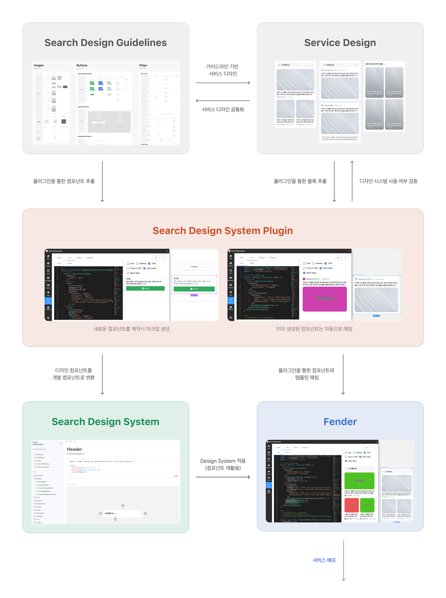

# Search Product FE

### 데이터 기반 FE DevOps로 사용자 중심 개선을 이끕니다
- 사용자 로그 수집 및 분석을 위한 시스템을 설계하고 운영하며, 실시간으로 성능과 오류 데이터를 모니터링합니다.
- 다양한 사용자 실험(A/B 테스트)을 설계하고 분석하여 기능 개선과 인터페이스 최적화의 근거를 마련합니다.
- 사용자 피드백을 기반으로 안정적이고 효율적인 서비스 환경을 제공합니다.
- 자주 사용되는 컴포넌트와 모듈을 식별·분석하여 레거시 코드의 최소화 및 시스템 개선을 가속화했습니다.

### 맞춤형 검색을 위한 유연한 UI 렌더링 시스템 개발
- Server-Driven UI 기반의 표준화된 프로토콜을 설계하여 사용자별로 최적화된 UI를 동적으로 제공합니다.
- 동일한 데이터로 사용자마다 다른 화면을 노출할 수 있어 유연한 A/B 테스트 및 실험이 가능합니다.
- 검색 디자인 시스템을 통해 일관된 UI 제공과 빠른 디자인 대응이 가능해 개발 효율성과 품질을 동시에 확보했습니다.

### 검색 서비스 FE 개발을 리딩하고 검색 통합 품질을 책임집니다.
- 검색 서비스의 일관된 사용자 경험을 위해 디자인 시스템 기반의 컴포넌트 라이브러리 바탕으로 검색 서비스 FE 개발을 리딩합니다.
- 통합검색 전반의 품질을 책임지며, 다양한 서비스 요구사항을 안정적이고 확장 가능한 구조로 풀어냅니다. 
- 단순 구현을 넘어 디자인, 사용자 경험, 검색 품질까지 아우르는 검색 FE의 기술적 방향성을 고민합니다.

### AI와 FE의 융합을 통한 검색 경험 혁신
- AI를 활용해 사용자의 니즈에 맞춘 콘텐츠 요약 및 추천 기능을 제공하여 새로운 검색 경험을 실험합니다.
- 다양한 사용자 요구사항을 만족시키기 위해 Design System 기반의 고성능 어플리케이션을 구현하고 지속적으로 개선합니다.

### 3천만 유저가 사용하는 오픈소스와 검색 Design System을 개발합니다.
- NAVER 주요 서비스에서 활용되는 오픈소스 UI 컴포넌트 egjs를 개발하고 유지보수하며, 프론트엔드 기술 문제를 해결합니다.
- 검색의 통일된 디자인 가이드와 컴포넌트 라이브러리를 통해 일관된 UI/UX를 제공하며, 사용자 경험의 품질을 높입니다.
- 빠르게 변화하는 요구사항에도 민첩하게 대응할 수 있도록 생산성과 확장성을 고려한 구조를 설계합니다.
- 주기적인 기술문서 작성 및 사내 기술 세미나를 통해 조직의 기술 역량 강화를 지원합니다.
- 사용자 경험을 향상시키기 위한 기술 리서치를 통해 서비스의 품질과 가치를 지속적으로 높입니다.

## 채용
> 우리 팀은 네이버 검색서비스를 개발하며 효과적인 개발을 위해서 지속적으로 개발 환경을 고도화를 합니다. 하나의 기술보다 지속적으로 나은 기술을 찾고 서비스에 적용하여 성장하도록 노력합니다. 
> 또한, 지금 당장 필요하지 않더라도 더 나은 단계로 나아가기 위한 미래 기술도 지속적으로 리서치하여 결과물을 만들고 있습니다. 우리의 활동을 아래 내용에서 확인하실 수 있고, 관심있으시면 연락 부탁합니다.

### 역할
- 네이버 검색 서비스 / AI 브리핑 등 검색 제품 FE 개발
- FE DevOps 시스템과 UI 랜더링 시스템 개발
- Design System 개발 / egjs opensource 라이브러리 개발

### 필요 역량
- FE 개발 경험
- Webpack / Babel
- ES 5+ / Typescript / React.js
- HTML 4+ / CSS 2.1+ 
- Git

### 우대 사항
- 오픈 소스 컨트리뷰션 및 활동
- 기술 기반 블로그 및 커뮤니티 활동
- Node.js 등 server-side 개발 경험
- docker/k8s등 cloud 환경 개발 경험
- Design System 개발 경험
- AI Tool 활용 경험
- 브라우저 동작 이해

### 채용하고 싶은 사람
- Front-End에 관심 있는 개발자
- 자신의 경험을 잘 나눌 수 있는 개발자
- 새로운 업무나 기술을 배우는데 거리낌 없는 개발자
- 동료와 협업하면서 업무를 함께 진행할 수 있는 개발자
- 문제을 찾고 정의하여 해결하는 개발자
- Self motivation이 가능한 개발자

## 관련 자료

### 발표

2021년 이전

    
- 2016년 [네이버의 모던 웹 라이브러리](https://deview.kr/2016/schedule#session/165)
- 2017년 [밑바닥부터 시작하는 360 뷰어](https://deview.kr/2017/schedule/204)
- 2019년 [React, Angular, Vue를 한 번에 지원하기 위한 설계 (Cross Framework Component)](https://deview.kr/2019/schedule/289)
- 2020년
    - [WebXR API를 이용한 웹 AR 개발, 그 한계와 대안](https://deview.kr/2020/sessions/361)
    - [성능개선 뛰어들기 (고전적 SSR 성능개선)](https://deview.kr/2020/sessions/346)
    - [egjs 오픈 서커스 오신것을 환영합니다. (InfiniteGrid, Flicking 등 오픈소스를 활용한 아이폰 화면 구현)](https://deview.kr/2020/sessions/400)

- **dan(deview)**
    - 2021년
        - [네이버 검색의 Server Driven UI - LAPIN](https://deview.kr/2021/sessions/454)
        - [React, Vue, Svelte… 변화하는 프레임워크 속에서 컴포넌트 발전하기](https://deview.kr/2021/sessions/499)
    - 2023년
        - [하나의 코드로 React, Vue, Svelte 등 모든 프레임워크를 지원할 수 있는 CFCs Reactive](https://deview.kr/2023/sessions/548)
    - 2024년
        - [데이터 기반으로 지속적 성장이 가능한 네이버 검색 FE 시스템 구축하기](https://dan.naver.com/24/sessions/622)
        - [네이버 검색에서 웹 성능 관리하는 방법: web-vitals 수집부터 개선까지](https://dan.naver.com/24/sessions/607)
- **NAVER Search Colloquium**
    - 2021년 [Front-end Engineering for Building an Immersive Experience in Search](https://searchcolloquium.naver.com/2021/)
    - 2022년 [Front-end Engineering for Rich Search Experience](https://searchcolloquium.naver.com/)

### 기사

2021년 이전

    
- 17년
    - [[데뷰2017] 네이버, 밑바닥부터 시작한 ‘360도 뷰어’ 어떻게 개발했나](http://m.ddaily.co.kr/m/m_article/?no=161212)
    

- 21년
    - [웹에서 뛰노는 실감콘텐츠 ‘웹XR’의 개선점과 한계는?](https://n.news.naver.com/mnews/article/138/0002102997?sid=001)
    - [[네이버 어벤저스] 네이버 안에서 3D 세계여행을?…‘웹 XR’이 온다](https://news.naver.com/main/read.nhn?mode=LSD&mid=shm&sid1=105&oid=138&aid=0002103040)
- 22년
    - [[네이버 어벤저스] “공룡이 궁금하면, 티라노사우루스에게 물어봐”](https://www.ddaily.co.kr/news/article/?no=238872)
    - [[네이버 어벤저스] 찰떡같이 알아듣는 ‘검색의 진화’…구글보다 빠르다](https://www.ddaily.co.kr/news/article/?no=238971)
- 24년
    - [[네이버 어벤저스] ‘AI 검색’한다면서, 왜 ‘디자인 시스템’부터 만들었을까?](https://www.ddaily.co.kr/page/view/2023112418224124800)
- 25년
    - [네이버 검색, 2.31초만에 주요 콘텐츠 다 띄운다](https://n.news.naver.com/mnews/article/011/0004462794?sid=105)

### 기술 공유

2021년 이전

    
- [AngularJS 도입 선택 가이드 공개합니다.](http://d2.naver.com/helloworld/1172239)
- React [적용 가이드1](http://d2.naver.com/helloworld/9297403), [적용 가이드2](http://d2.naver.com/helloworld/1848131)
- jQuery 애니메이션은 어떻게 작동하는가? [기본 편](http://d2.naver.com/helloworld/0265052), [심화 편](http://d2.naver.com/helloworld/4424601) , [응용 편](http://d2.naver.com/helloworld/9323973)
- [jQuery는 이벤트를 어떻게 처리하는가?](http://d2.naver.com/helloworld/1855209)
- [2016년과 이후 JavaScript의 동향](http://d2.naver.com/helloworld/3618177)
- 2017년과 이후 JavaScript의 동향 [1](https://d2.naver.com/helloworld/2809766), [2](https://d2.naver.com/helloworld/7229119), [3](https://d2.naver.com/helloworld/0473039),
- 2018년과 이후 JavaScript의 동향 [1](https://d2.naver.com/helloworld/7495331), [2](https://d2.naver.com/helloworld/3259111)
- [하드웨어 가속에 대한 이해와 적용](http://d2.naver.com/helloworld/2061385)
- [네이버 쇼핑의 새로운 카드형 UI 라이브러리, eg.InfiniteGrid](http://d2.naver.com/helloworld/4874130)
- [사용자의 액션에 반응하는 UI 라이브러리, eg.Axes](https://d2.naver.com/helloworld/0590136)
- [카드형 UI와 eg.InfiniteGrid 3.0](https://d2.naver.com/helloworld/0637045)
- [User-Agent Client Hints의 도입, UA 프리징을 대비하라](https://d2.naver.com/helloworld/6532276)
- [WebXR Device API를 이용한 웹 AR 구현, 그 한계와 대안 - 이론 편](https://d2.naver.com/helloworld/0527763)
- [WebXR Device API를 이용한 웹 AR 구현, 그 한계와 대안 - 실전 편](https://d2.naver.com/helloworld/0189619)

- [웹 3D 모델 최적화 기법 소개](https://d2.naver.com/helloworld/6152907)
- [뭣? 딸깍 몇 번에 웹 E2E 테스트 코드를 생성하고 수행한다고? 에러도 잡아준다고? 영상도 뽑아준다고?](https://d2.naver.com/helloworld/4003712)
- [네이버 통합 검색의 웹 성능 - 데이터 수집과 시각화](https://d2.naver.com/helloworld/9227596)
- [네이버 통합 검색의 웹 성능 - 모니터링과 성능 개선](https://d2.naver.com/helloworld/8113611)
- [네이버 검색 클라이언트 로그 수집 - Beacon API 전환기](https://d2.naver.com/helloworld/1773964)
- [2024 네이버 통합검색의 웹 성능 리뷰](https://d2.naver.com/helloworld/9582944)
- [[DAN 24] 데이터 기반으로 지속 성장이 가능한 네이버 검색 FE 시스템 구축하기](https://d2.naver.com/helloworld/3435419)

### 링크
- [egjs 오픈소스](http://naver.github.io/egjs/)
- [기술 블로그](https://medium.com/naver-fe-platform)
- [기술 행사](https://github.com/NAVER-FEPlatform/FEDevtalk)

> 우리 팀에 관심이 생기셨나요? 언제나 같이 고민하고 해결할 팀원분들을 찾고 있습니다.
> 관심있으시면 `dl_search_fe_hiring@navercorp.com`으로 연락주시면 하루안에 답변드리겠습니다.
    
