# 네이버 쇼핑 플랫폼

매일 3,000만명의 사용자와 스몰 비즈니스의 상품을 연결하는 쇼핑 플랫폼!
네이버 쇼핑 서비스를 개발하는 Forest CIC 의 플랫폼 팀 입니다.

----

## 쇼핑 검색
국내/외 수 많은 구매자와 판매자를 검색이라는 플랫폼을 통해 연결합니다.

React, Next.js등의 최신 기술을 통해 사용자가 원하는 상품을 가장 잘 찾을 수 있는 UI를 개발하고 서비스 합니다

| 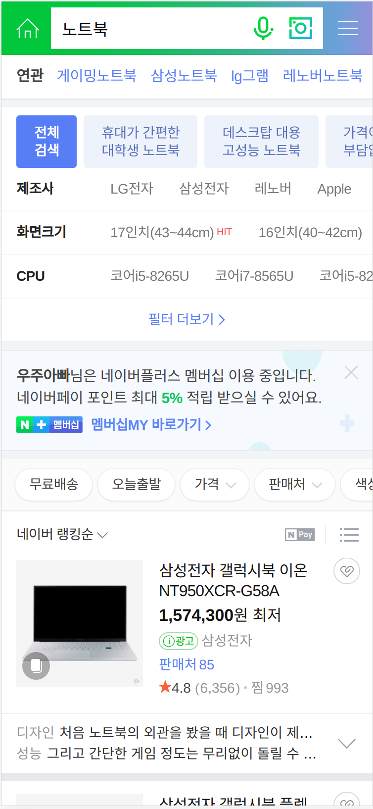 | 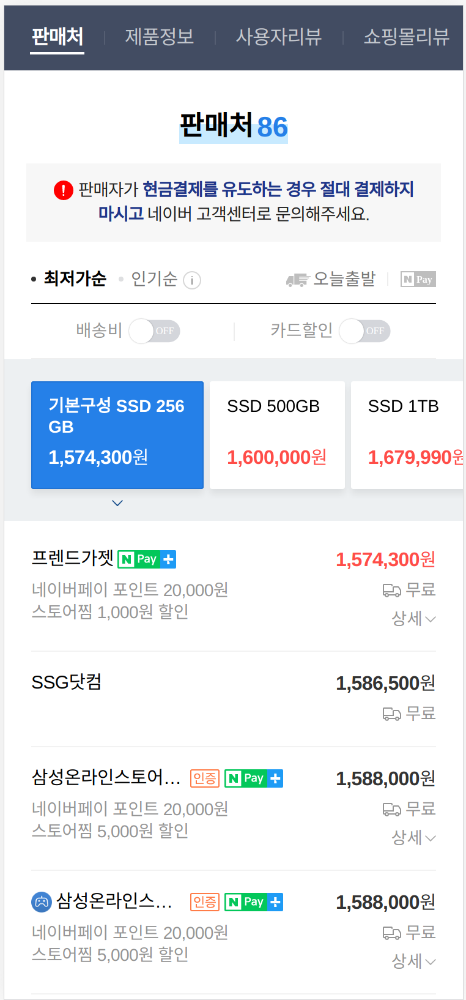 | 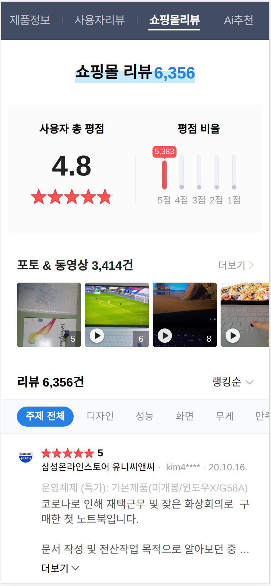 |
| -- | -- | -- |
| 
쇼핑검색
 | 
가격비교
 | 
리뷰
 |

Ai를 활용한 추천 기술로 사용자가 입력한 검색어에 가장 알맞은 검색 결과를 제공하는 서비스도 개발 하고 있습니다.

| 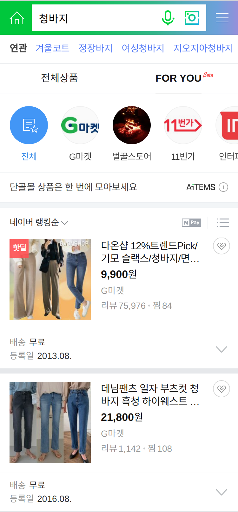 | 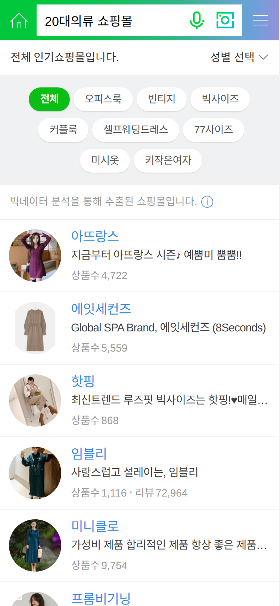 | 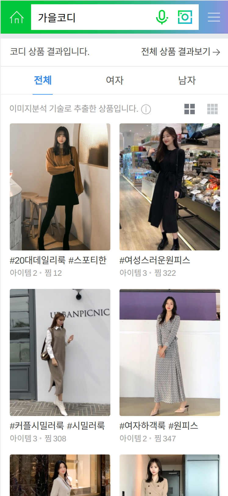 |
| -- | -- | -- |
| 
For You
 | 
몰 검색
 | 
코디검색
 |

### 자유롭고 활발한 개발문화!
코드리뷰, scrum을 통해 업무와 개발에 대해서 같이 고민하며 성장하는 문화를 만들어 가고 있습니다. 

----

## 버티컬 커머스
백화점윈도, 아울렛윈도, 스타일윈도, 디자이너윈도, 뷰티윈도, 리빙윈도, 푸드윈도, 플레이윈도 등 온/오프라인을 아우르는 쇼핑윈도 서비스를 개발합니다.
각각 윈도의 특성을 감안한 최적의 UI 로 상품과 정보를 노출하는 특징을 갖고 있습니다.

그 외에도 스마트스토어의 BEST 생필품을 모아 쉽게 노출하고 빠르게 구매할 수 있게 하는 특가 창고
일상생활에서 반복 소비되는 상품군을 최고의 혜택으로 구매가능하게 하는 장보기
직접 방문하지 않아도 원하는 곳으로 편리하게 구매하고 받아볼 수 있는 동네시장 장보기, 기획전, 선물하기,
럭키 투데이, 쇼핑 AiTems, 쇼핑MY 등의 다양한 쇼핑 서비스를 담당하고 있습니다.

| 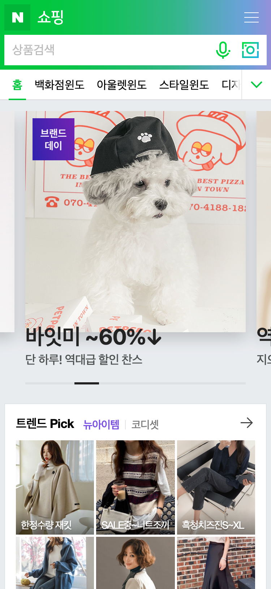 | 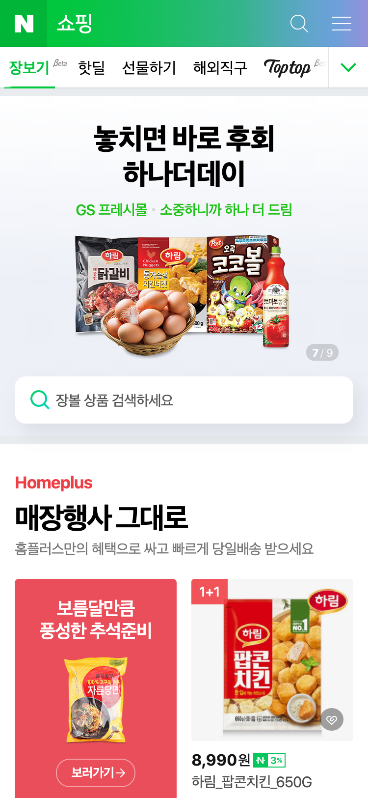 | 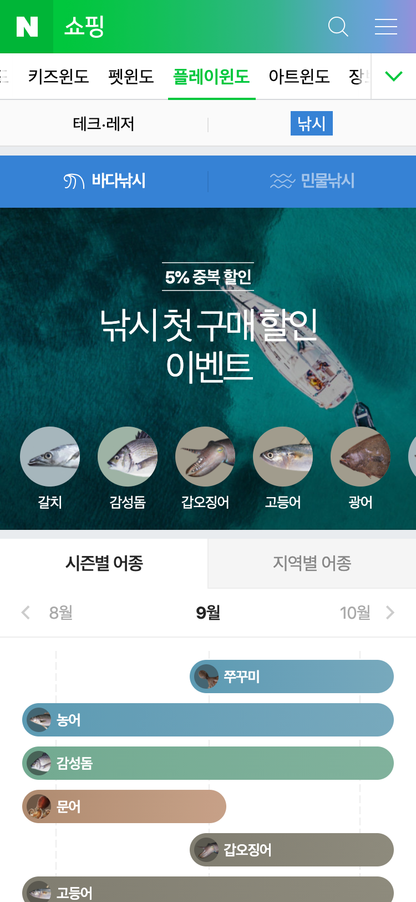 |
| -- | -- | -- |
| 
네이버 쇼핑 홈
 | 
장보기
 | 
플레이윈도-낚시
 |

----

## 스마트스토어
쇼핑몰이 없는 사업자나 사업 경험이 없는 개인도 스토어 개설부터 상품을 등록하고
네이버 쇼핑에 노출할 수 있는 쇼핑몰 솔루션 서비스 입니다.
상품관리, 판매관리, 전시관리 등 쇼핑몰 운영에 필요한 필수 도구들을 제공하고, 스마트스토어,
브랜드스토어, 탑탑 등 판매자와 브랜드만의 특성을 살린 스토어와 상품의 페이지를 개발 하고 있습니다

## 쇼핑 라이브 
라이브 영상으로 상품을 실시간 소개하고 판매할 수 있는 '라이브 커머스 툴' ,
판매자들이 언제든 자유로이 오픈 라이브 방송을 진행하여, 고객과 쌍방향으로 소통하며,
자신의 상품과 스토어를 홍보할 수 있는 서비스입니다. 

| 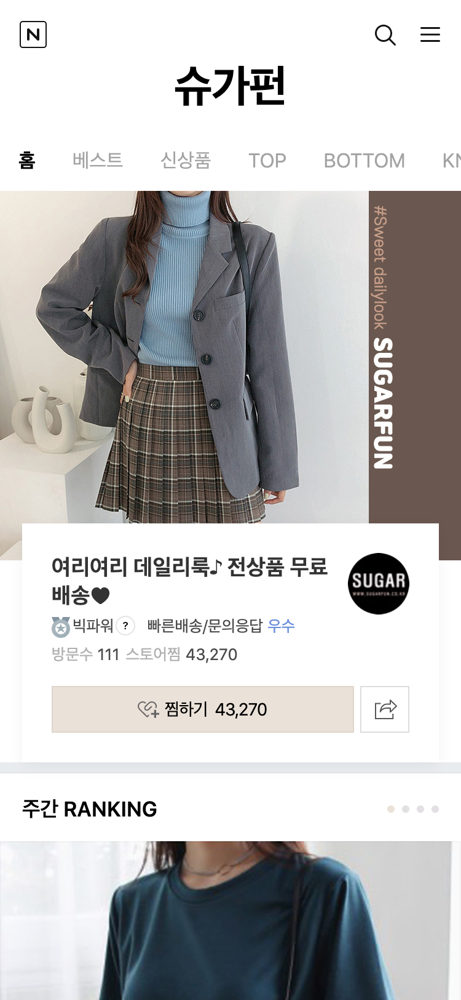 | 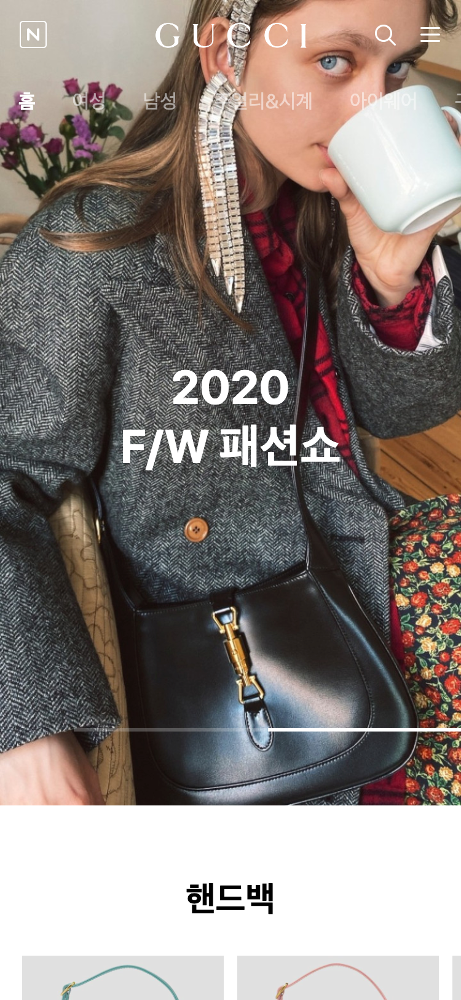 | 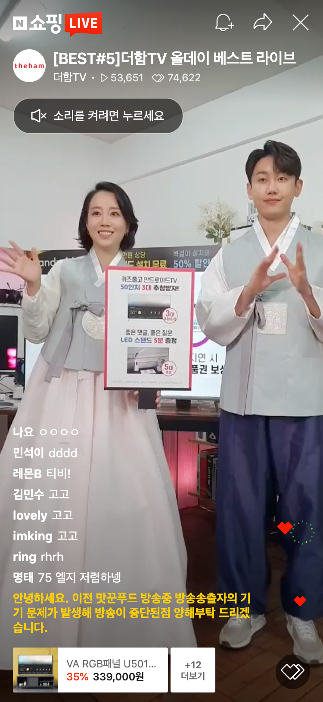 |
| -- | -- | -- |
| 
스마트스토어
 | 
브랜드스토어
 | 
쇼핑 라이브
 |

----

# _"쇼핑은 네이버!"_
라고 할 만큼 네이버 쇼핑은 강력한 시장 경쟁력을 가지고 있습니다.

최근 3~4년간 폭발적인 서비스 성장을 하고 있고
현재 네이버의 견고한 성장을 이끌어가는데 매우 중요한 역할을 하고 있습니다.

이러한 네이버 쇼핑서비스에서 온라인/오프라인을 넘나드는
매력적인 서비스를 다양한 기술 환경에서 개발하실 수 있습니다.
대량의 트래픽이 들어오는 매력적인 서비스 개발을 경험하고 싶으신 분은 도전해주세요.

# _"네이버 쇼핑플랫폼에 오신다면"_
- 최신 오픈소스 기반의 개발환경에서 다양한 서비스를 개발할 수 있습니다.
- 대용량 데이터를 기반으로 하는 높은 트래픽 서비스의 개발 운영을 통해,
높은 수준의 분산처리, 비동기 처리, 스트림 처리 개발을 경험할 수 있습니다.
- 네이버 성장을 견인하는 쇼핑 서비스를 개발, 운영하면서 본인 업무에 대한 자부심을 가질 수 있습니다

## 역할
- 상품/리뷰/콘텐츠/혜택 개발
- 스토어 전시, 쇼핑 윈도 전시, 버티컬 전시, 쇼핑 라이브 개발
- 스토어 주문/결제/배송/클레임/정산 개발
- 웹 기반 채팅/챗봇, 알림 서비스 개발
- 지표 수집/분석 시스템 개발

## 필요 역량
- 개발 경력을 2년 이상 보유하신 분
- Typescript/ES6+/NodeJS 개발 경험을 보유하신 분

## 우대 사항
- ReactJS, VueJS, AngularJS, Bootstrap, Webpack 등을 활용한 FE 개발 경험을 보유하신 분
- Docker / Kubernetes 를 사용한 서비스 개발 및 운영 경험을 보유하신 분