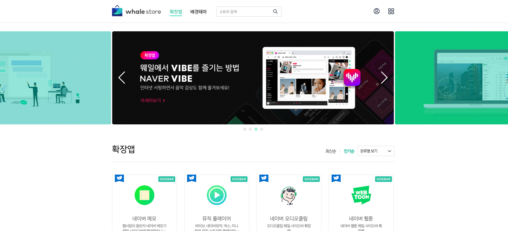
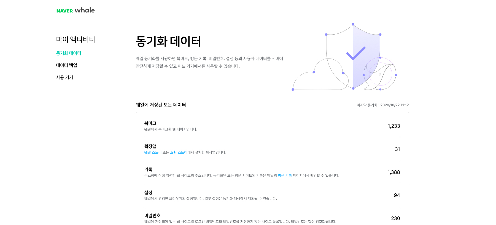
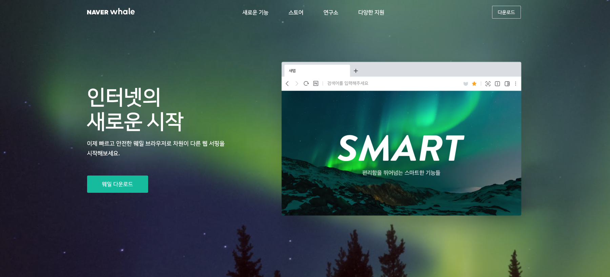
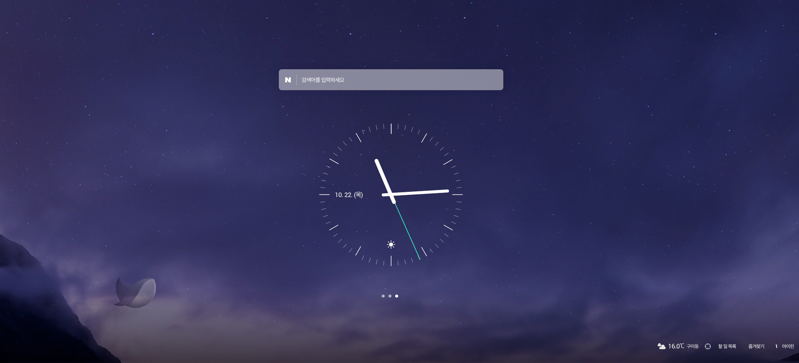
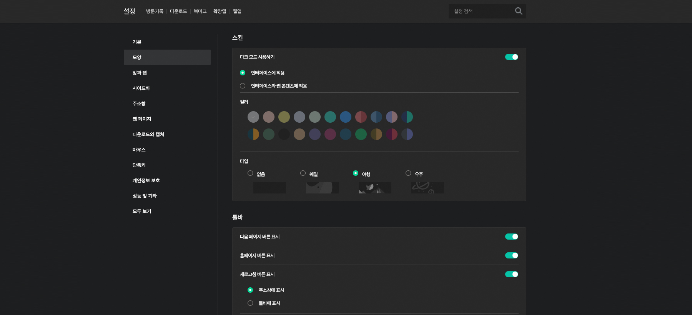
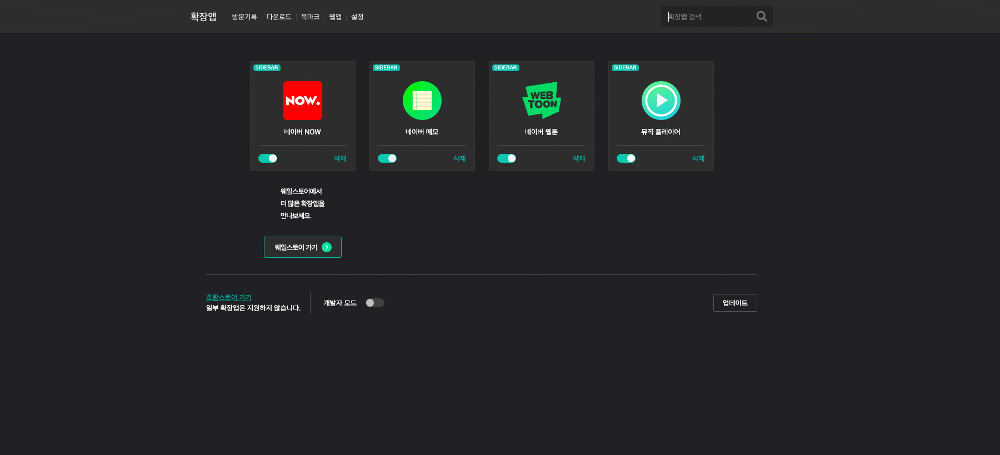
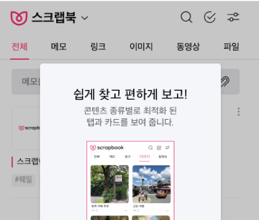
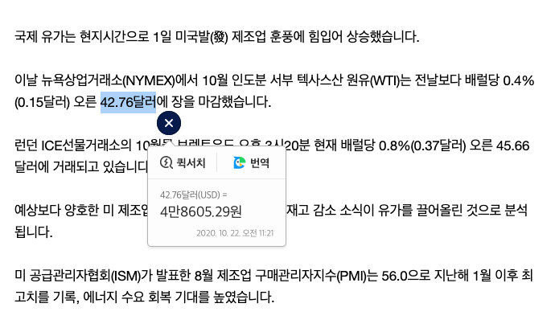
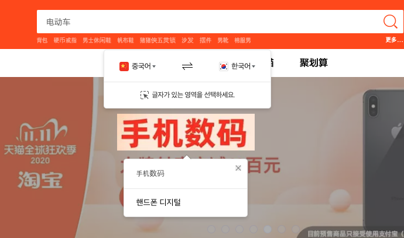
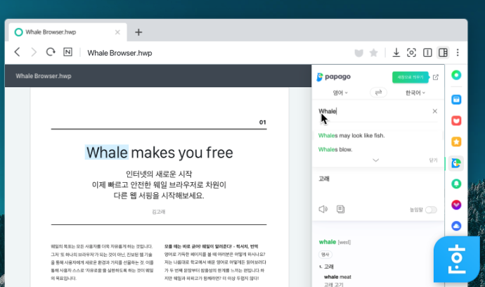

# Whale WebUI

네이버 웨일 브라우저 사용자 인터페이스와 웹 서비스를 개발합니다.

새 탭, 북마크, 방문기록, 다운로드, 퀵서치, PDF/HWP뷰어, 미디어 플레이어 등 브라우저 UI 와
홈페이지, 헬프센터, 연구소, 마이액티비티, 스크랩북 등 관련 웹 서비스 개발을 담당하고 있습니다.

|  |  |  |
| -- | -- | -- |
| 
웨일스토어
 | 
마이액티비티
 | 
홈페이지
 |
|  |  |  |
| 
새 탭
 | 
설정
 | 
확장앱 관리자
 |

텍스트 드래그만으로 바로 답을 얻을 수 있는 퀵서치, 브라우저에 내장된 HWP 문서 뷰어,
쉽게 콘텐츠를 답고 편하게 볼 수 있는 스크랩북, 이미지 안에 있는 글자 번역, 선택한 텍스트 음성으로 듣기 등
스마트한 사용자 편의 기능을 웹 기술로 만듭니다.

|  |  |  | 
| -- | -- | -- | -- |
| 
스크랩북
 | 
퀵서치
 | 
이미지 번역
 | 
HWP 뷰어

### Move the web forward

**시**대가 **바**뀌면 **브**라우저도 **바**뀐다. *#시바브바*
더 자유로운 웹 환경을 만드는 새로운 브라우저를 만듭니다.

네이버 웨일 WebUI 팀에서는 최신 웹 엔진 기반 환경에서 다양한 서비스를 개발할 수 있습니다.
새로운 웹 기술과 브라우저 개발을 경험할 수 있습니다.

## 역할

- 웨일 브라우저 WebUI 개발
- 웨일 웹 서비스 개발  (홈페이지, 스토어, 스크랩북, 마이액티비티, 개발자센터 등)
- 웨일 확장앱 개발

## 필요역량

- ES6+, HTML5, CSS3 개발 경험
- Webpack, Git

## 우대사항

- Vue.js, Polymer, React, Lit-Element 등을 활용한 FE 개발 경험
- 모바일을 포함한 다양한 환경에서의  FE 개발 경험
- 브라우저 동작에 대한 이해

## 채용하고 싶은 사람

- 새로운 업무나 기술을 배우는데 거리낌 없는 사람
- 동료와 협업하면서 업무를 함께 진행할 수 있는 사람
- 아이디어가 풍부하고 새로운 것을 만드는 것을 좋아하는 사람
- 자신의 기술과 경험을 잘 나눌 수 있는 사람
